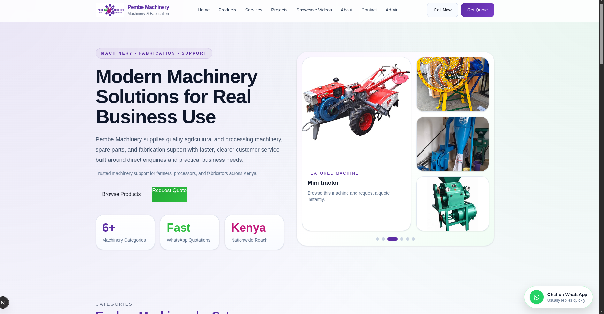
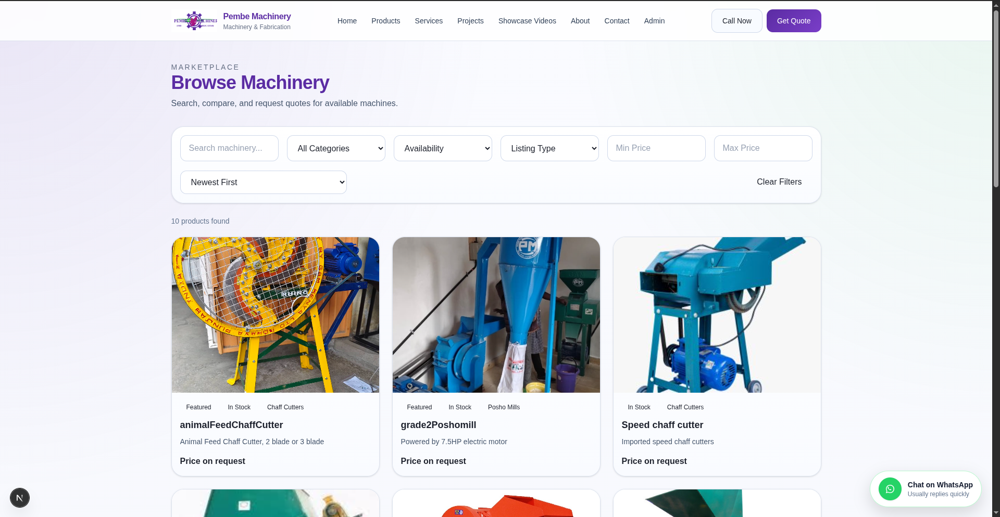
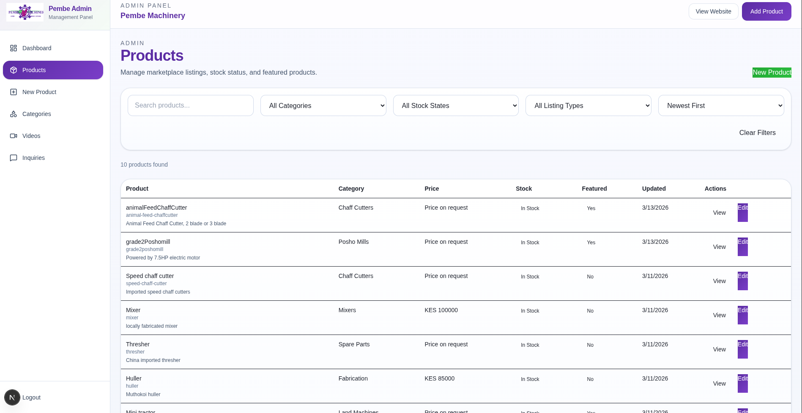

# Pembe Machinery 🏗️

A full-stack machinery business platform designed to showcase products, manage inventory, and support customer inquiries through a clean, modern interface.

This project demonstrates **end-to-end full-stack development**, from database design and backend APIs to frontend UI and deployment-ready structure.

---

## 🚀 Overview

Pembe Machinery is built as a scalable business platform focused on:

- Clear product presentation
- Structured data management
- Admin-friendly workflows
- User-focused browsing experience

The system is designed to bridge **business needs and technical execution**, ensuring both usability and maintainability.

---

## 🎬 Demo (Coming Soon)

  

> A short walkthrough showing navigation, product browsing, and core user interactions.

---

## 📸 Screenshots

### Landing Page

  

### Products Section

  

### Admin / Dashboard (Optional)

  

---

## 🧰 Tech Stack

### Frontend
- Next.js
- React
- TypeScript
- Tailwind CSS

### Backend
- Node.js / Django *(adjust to your actual stack)*
- REST API

### Database
- PostgreSQL
- Prisma *(if used)*

### Infrastructure
- Docker
- Linux
- Git / GitHub

---

## 🔥 Key Features

- Product catalog with structured categories
- Admin product management
- Responsive UI (mobile & desktop)
- Clean and intuitive navigation
- API-driven frontend/backend communication
- Scalable architecture for future expansion

---

## 🧠 Architecture Overview

- **Frontend:** Next.js (App Router)
- **Backend:** API-driven service (REST)
- **Database:** PostgreSQL (relational modeling)
- **Data Flow:** Client → API → Database

Designed with **separation of concerns** to ensure scalability and maintainability.

---

## 📂 Project Structure

pembe/
├── frontend/ # Next.js application
├── backend/ # API layer
├── prisma/ # Database schema (if applicable)
├── docker/ # Container setup
└── README.md

---

## ⚙️ Setup

### Install dependencies

npm install

🎯 Purpose

This project demonstrates:

Full-stack application development
Backend API design and integration
Database modeling and management
Real-world business platform implementation
Scalable system architecture

📬 Contact

Email: paulwamaria@gmail.com
Portfolio: https://paulwamaria.netlify.app
GitHub: https://github.com/Paulwamaria

Built to demonstrate real-world full-stack development with a focus on structure, usability, and scalability.